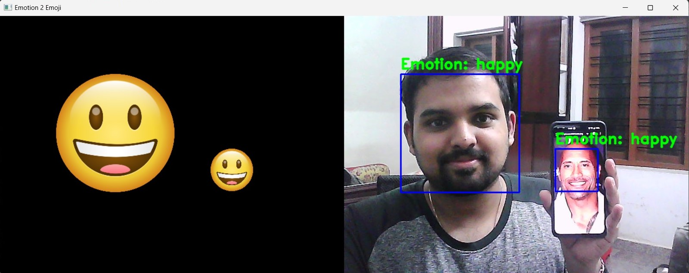

<b><h1 align="center"> Emotion2Emoji </h1></b>
<h5 align="center"> A lightweight system that displays emojis corresponding to the facial emotion in a live webcam feed. </h5>

---
# See demo video [here](https://youtu.be/RnYWvHqkous)

<h2> Problem Statement </h2> 

There is a growing need for technology that enhances communication and caters to diverse user needs. Current video conferencing and chat platforms often lack rich nonverbal cues, which can lead to misunderstandings or hinder emotional expression. This project proposes a lightweight real-time system that analyzes a live webcam feed and overlays corresponding emojis based on the user's facial expressions.

---
<h2> Solution </h2>

Run this application on your system:

Download this repository:

    git clone https://github.com/004Ajay/Emotion2Emoji.git

Move to the project folder:

    cd Emotion2Emoji
    
Install required libraries:

    pip install tensorflow, deepface, numpy, opencv-python

_Initial run may take some time as the above libraries need to download models and weights related to recognition._ 

Run the code:

    python main.py

---
<h2> Technology Stack </h2>

* Python

* TensorFlow

* OpenCV 

<h2> System Design: </h2>

---

Features:

* **Real-time Responsiveness**: The system works spontaneously without a setback, providing instant feedback for a seamless user experience.

* **Multi-face Detection**: No face goes unnoticed! The project can detect multiple faces simultaneously, catering to diverse use cases.

* **Stability**: The system is designed for stability, ensuring a reliable performance every time.

---

Drawbacks:

* When head is tilted sideways the face detection won't work, this is a problem with Haarcascade Classifier.

* Even though the system is very stable most of the time, the system randomly fails for unknown reasons.

* The system works perfectly when there is a single face in detection, but fails to give the correct emotions when there are multiple faces. Anyway the system show equal number of emojis as number of faces in detection.

---
<h2> Team Details </h2>

Ajay T Shaju : [LinkedIn](https://www.linkedin.com/in/ajay-t-shaju/)  |  [GitHub](https://github.com/004Ajay)

 

Afna Ayshu Jaffin : [LinkedIn](https://www.linkedin.com/in/afna-ayshu-jaffin-02b38b201/)  |  [GitHub](https://github.com/afnaayshu)
